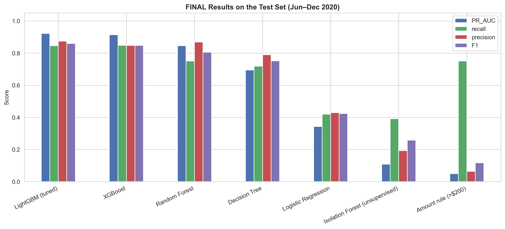
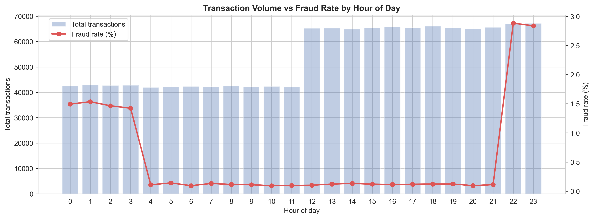
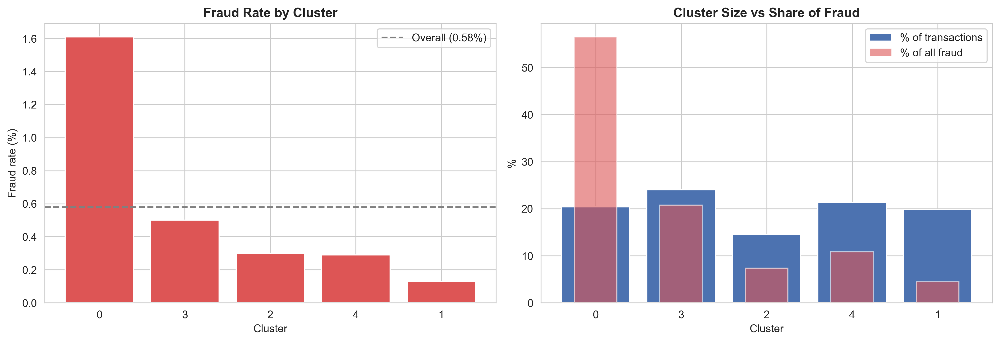
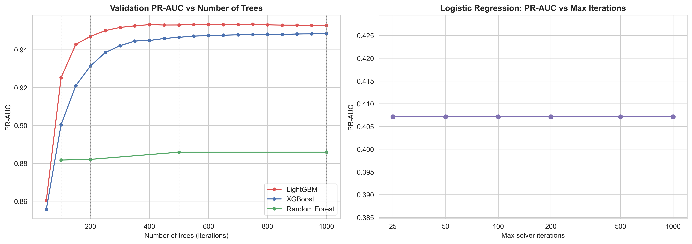

# Card Transaction Fraud Detection
### Customer & Merchant Behaviour Analysis using Machine Learning

**Course:** Fraud Detection Analytics  
**Author:** V Adithya (PRN 25030242063)  
**Institute:** Symbiosis Centre for Information Technology (SCIT), Pune

---

## Overview

This project detects fraudulent credit card transactions and explains the behaviour behind them. It covers the full flow: exploratory analysis, behavioural feature engineering, unsupervised clustering and anomaly detection, a comparison of sampling strategies, five machine learning models with iteration experiments and tuning, and an honest evaluation on a held-out future period.

**Headline result:** a tuned LightGBM model catches **85% of fraud** (1,815 of 2,145 frauds) on unseen test data with only **261 false alarms**, versus **23,738 false alarms** for a simple "flag everything above $200" rule.



## Dataset

**Credit Card Transactions Fraud Detection Dataset** (Sparkov simulation), Kaggle: <https://www.kaggle.com/datasets/kartik2112/fraud-detection>

| Part | Transactions | Frauds | Period |
|---|---|---|---|
| `fraudTrain.csv` | 1,296,675 | 7,506 (0.58%) | Jan 2019 – Jun 2020 |
| `fraudTest.csv` | 555,719 | 2,145 (0.39%) | Jun – Dec 2020 |
| **Total** | **1,852,394** | **9,651 (0.52%)** | |

- 22 raw columns: transaction time, amount, merchant category, card number, customer details, home and merchant coordinates, and the `is_fraud` label.
- The data is **synthetic** (generated by a simulator to resemble real card activity), so it has no missing values and some patterns come from the generator's fraud profiles.
- The CSV files are **not included** in this repository (too large for GitHub). Download them from Kaggle and place them in `data/raw/`.

## Notebooks

Run them in order.

| Notebook | What it does |
|---|---|
| `01_eda.ipynb` | Data quality checks, class imbalance, and fraud patterns by amount, merchant category, time, customer profile, geography and card behaviour |
| `02_feature_engineering.ipynb` | Time, customer, location and behaviour features (past-only, no leakage) |
| `03_clustering.ipynb` | K-Means behaviour segments (k = 5) and Isolation Forest anomaly detection |
| `04_sampling_and_models.ipynb` | 7 sampling strategies, 5 models, iteration experiments (100–1000 trees), LightGBM tuning, final test evaluation, feature importance |

## Method

- **Time-based evaluation:** models learn from the past and are tested on the future.

| Period | Dates | Role |
|---|---|---|
| Fit | Jan 2019 – Mar 2020 | model training during experiments |
| Validation | Mar – Jun 2020 (last 90 days of train) | all choices: sampling strategy, trees, settings, thresholds |
| Test | Jun – Dec 2020 | final evaluation only, never used for any choice |

- **Metrics:** PR-AUC (main metric), precision, recall, F1, ROC-AUC, plus counts of frauds caught, missed and false alarms. Accuracy is not used, because predicting "legitimate" for everything scores 99.4%.
- **Features (about 30 in the models):** hour (plus sine/cosine), night flag, weekend flag, age, gender, city size, distance from home, log amount, hours since the card's previous use, amount compared with the card's usual spend, transactions in the last 1 hour and 24 hours, and one-hot merchant category. Behaviour features use only earlier transactions.
- **Excluded columns:** names, street, city, zip, card number, transaction ID, merchant name, job, date of birth, exact coordinates.

## Key findings

**EDA**
- Fraud is rare: 1 in 172 training transactions.
- Median fraud amount is $397 vs $47 for legitimate; 76% of fraud sits in the ~5% of transactions between $200 and $1,500.
- Online shopping has about 2.4x the fraud rate of in-store shopping (1.76% vs 0.72%); grocery in-store has the most fraud cases.
- 85% of fraud happens between 10 pm and 4 am.
- A compromised card sees a median of 10 fraud transactions within about 1.9 days, with fraud arriving about 1.4 hours after the previous use (vs 4.6 hours for legitimate).
- Distance from home shows no difference between fraud and legitimate transactions.



**Clustering and anomaly detection**
- K-Means found a high-velocity segment (cluster 0) with 20% of transactions but 56.5% of all fraud.
- Isolation Forest, trained without labels, catches 43% of test fraud in the 1% most unusual transactions (ROC-AUC 0.87), but most of its alerts are false.



**Sampling and models**
- Rebalancing the training data raised LightGBM's validation PR-AUC from 0.53 to about 0.95. Random undersampling (1:10), class weights and cluster-based undersampling tied; undersampling was chosen as the fastest.
- LightGBM levels off at about 500 trees; Random Forest is flat after 100; Logistic Regression is unchanged at every iteration setting.
- Tuning eight LightGBM settings improved validation PR-AUC only from 0.951 to 0.953.
- Amount carries about 61% of the best model's feature importance, followed by merchant category (~11%), time of day (~10%) and card behaviour (~8%).



## Final results (test set, Jun–Dec 2020)

| Model | PR-AUC | Precision | Recall | F1 | Frauds caught | Missed | False alarms |
|---|---|---|---|---|---|---|---|
| **LightGBM (tuned)** | **0.922** | 87.4% | 84.6% | 0.860 | 1,815 | 330 | 261 |
| XGBoost | 0.914 | 84.7% | 84.8% | 0.848 | 1,819 | 326 | 328 |
| Random Forest | 0.846 | 86.9% | 75.1% | 0.805 | 1,610 | 535 | 243 |
| Decision Tree | 0.694 | 78.9% | 71.8% | 0.752 | 1,540 | 605 | 411 |
| Logistic Regression | 0.343 | 42.9% | 41.9% | 0.424 | 899 | 1,246 | 1,198 |
| *Isolation Forest (unsupervised)* | 0.108 | 19.2% | 39.2% | 0.258 | 840 | 1,305 | 3,531 |
| *Amount rule (> $200)* | 0.049 | 6.4% | 75.1% | 0.117 | 1,611 | 534 | 23,738 |

Decision thresholds were fixed on the validation period before the test set was scored.

## Repository structure

```
.
├── 01_eda.ipynb
├── 02_feature_engineering.ipynb
├── 03_clustering.ipynb
├── 04_sampling_and_models.ipynb
├── outputs/
│   ├── figures/        # charts from all notebooks
│   └── tables/         # result tables (CSV)
├── presentation/       # project slides
├── requirements.txt
└── README.md
```

## How to run

1. Install the libraries: `pip install -r requirements.txt`
2. Download `fraudTrain.csv` and `fraudTest.csv` from Kaggle and place them in `data/raw/`.
3. Run the notebooks in order (01 → 04). Charts, tables and intermediate files are written to a `fraud-outputs` folder in your home directory; a copy of the charts and tables is included in `outputs/`.

## Limitations

- Synthetic data: the sharp 10 pm / 4 am cut-offs and the absence of fraud above $1,500 come from the simulator, and real-world performance is likely lower.
- US transactions from 2019–2020 only.
- The decision threshold maximises F1, not an actual business cost of missed fraud vs false alarms.
- Sampling strategies were compared using two models (LightGBM and Logistic Regression); the other models used the winning strategy.

## Next steps

- SHAP and feature-group removal tests to measure what each feature adds beyond the others.
- A cost-based decision threshold.
- Validation on real bank data.
